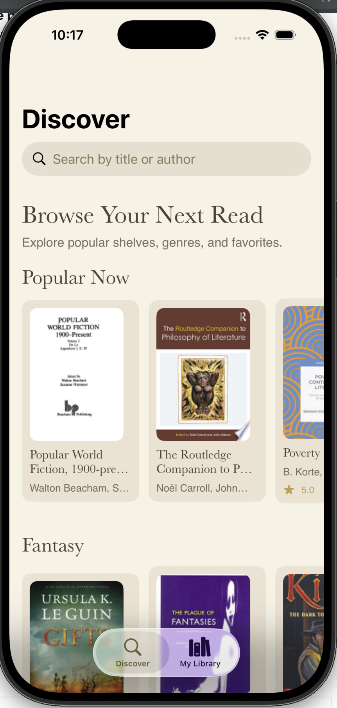
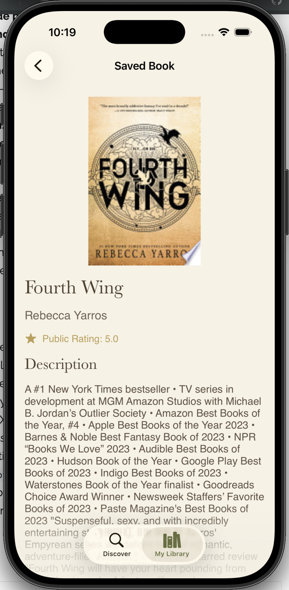
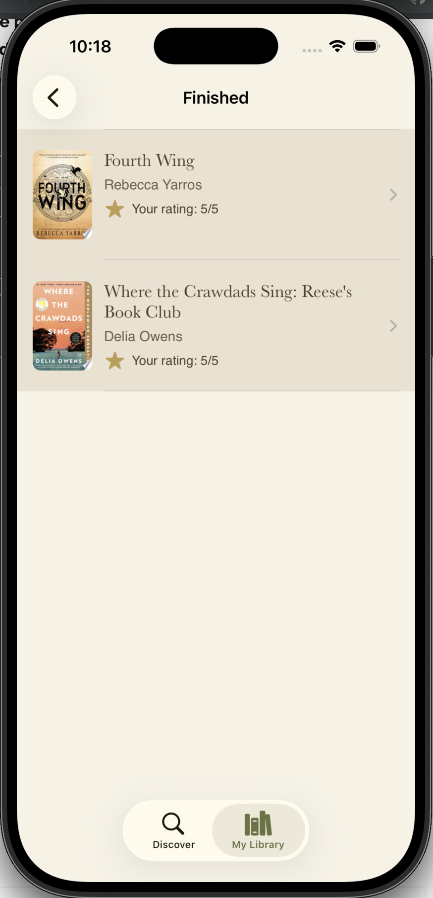

# Native App Development — Final Project
# MyBookLibrary

Starter repository for NMIX 4030/6030. See the assignment page for full instructions.  
> MyBookLibrary is a cozy, Goodreads-style SwiftUI iOS app for discovering books with the Google Books API and organizing them into personal reading lists. Users can browse by genre, search by title/author, save books into custom lists, and track personal notes and star ratings.

## What to submit
## Screenshots

Your repo should contain the following when you submit:
<!-- Save your screenshots to an `assets/` folder at the root of this repo, then update the image paths below. -->

- Your Xcode project folder (the complete app)
- - `prompt.md` — your initial prompt (replace the placeholder)
  - - `edits.md` — numbered list of manual adjustments (replace the placeholder)
    - - `reflection.md` — 150-300 word reflection (replace the placeholder)

## How to Run

1. Open `Final Project/MyBookLibrary.xcodeproj` in Xcode
2. Select a simulator (e.g., iPhone 16 Pro) and press **Run** (⌘R)

## What's in this repo

| File / Folder | Description |
|---|---|
| `Final Project/` | The complete Xcode project folder |
| `assets/` | Screenshots used in this README |
| `prompt.md` | The AI prompt used to generate the initial app |
| `edits.md` | Numbered list of manual edits made after generation |
| `reflection.md` | 150–300 word reflection on the project |

---

*NMIX 4030/6030 — Native App Development Final Project*
